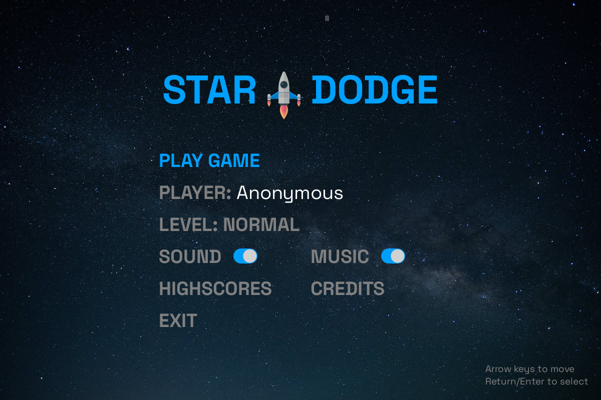
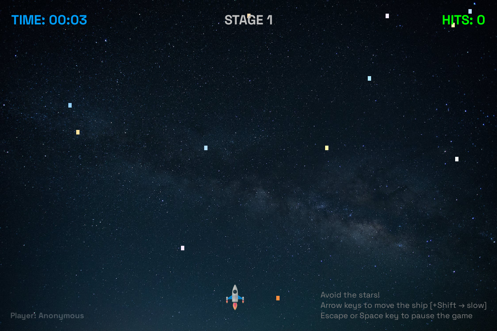
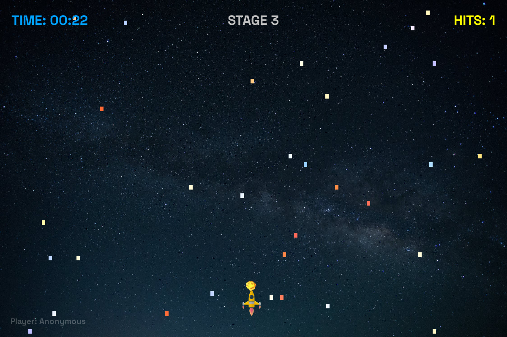

# Star Dodge

StarDodge is a simple 2D game. The goal is to navigate a space ship through stars and to avoid collisions. The game was
written in a school course to teach Python programming for pupils starting at the age of 14. It is intended to teach the
following principles:

1. General introduction into Python and the eco system
2. Object oriented programming. The game uses classes for the ship, stars, and the different game states such as the
   menu and game state (amongst others)
3. 2D drawing using the Pygame library
4. Game main loop and frame rate
5. General Python, like handling data structures such as lists, tuples, dictionaries
6. Asynchronous I/O when working with high score server

The game can optionally work with a high score server, this is where asynchronous I/O is used, see command line options
and the Github project *Star Dodge Server*.

## Screenshots

### Main menu



### Game right after start



### Game stage 3 hitting star



## Installation

### Prerequisites

- Python 3.12 and later
- Required libraries listed in `requirements.txt`

```bash
pip install -r requirements.txt
```

## Command line options

You can customize the game’s behavior by passing in command-line parameters, see `python game.py --help`.

### Command Line Parameters

You can customize the game’s behavior by passing in the following command-line parameters:

- `-w`, `--window` [width height]: Run the game in window mode. By default,
  game runs in fullscreen mode. Using -w without integers will use default window size 1200x800 pixels.
  You may optionally provide two integer arguments to change the window size (e.g., `-w 1920` or `-w 1000 640`).
  Using only one integer for example -w 1920 will run game in 16x9 aspect ratio, ie. would equal `-w 1920 1080`.
  Providing both, with and height will use the parameters for height and width.
- `-v`, `--verbose`: Enable verbose output, writing information to the console.
- `-sh`, `--score_server_host` [hostname or IP]: Specify the hostname or IP address of the score server to determine the highest score.
- `-sp`, `--score_server_port` [port]: Specify the port number of the score server (default is `8123`).
- `-pfr`, `--print_frame_rate`: Print the frame rate of the game every 5 seconds.
- `--store_time_num_stars_csv`: Store a CSV file that shows how stars are created over time. This can help to optimize the game logic.

### Example Usage

#### Run game in fullscreen
```bash
python game.py
```
#### Run game in windowed mode with various options
```bash
python game.py -w           # default 1200x800 size
python game.py -w 1920      # use 1920 as width and height as 9/16*1920 = 1080
python game.py -w 1000 640  # use 1000x640 pixels as window size
```

#### Run game with verbose console output and connection to start dodge high score server
```bash
python game.py -v -sh 127.0.0.1
python game.py --verbose --window 1600 --score_server_host 127.0.0.1
```
